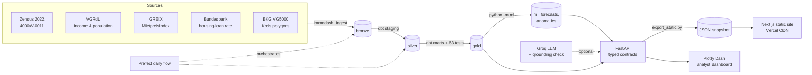

# ImmoDash — German rental market intelligence

A data platform and interactive dashboard for the German rental market. It brings together
**asking rents for 37 cities (monthly, 2012 to June 2026)**, **Zensus 2022 rents for all 400 Kreise**
(by rooms, by floor area, and on a **100 m grid** inside the cities), **vacancy**, **household income
and population**, and **housing-loan rates**. On top of that it computes an affordability index,
a supply-vs-demand index, **3/6/12-month rent forecasts** (LightGBM, calibrated intervals), **anomaly
flags**, and a **grounded AI market summary** per city.

Everything is built from open, official or academic sources. Nothing is scraped from listing portals
(see [ADR 0002](docs/adr/0002-open-data-instead-of-scraping.md)).



| Layer | Tooling |
|---|---|
| Ingestion | Python (`requests`, `pandas`, `openpyxl`), one parser per source, idempotent bronze loads |
| Warehouse | DuckDB locally, PostgreSQL in production. The same dbt project runs on both. |
| Transformations | dbt: bronze → silver (staging views) → gold (marts), plus 63 data tests |
| Intelligence | LightGBM quantile regression + conformal calibration, robust-z anomaly detection, Groq LLM with a numeric grounding check |
| Geo | pyproj + shapely: 136k 1 km and 245k 100 m Zensus grid cells assigned to Kreise |
| Orchestration | Prefect flow `immodash-daily-refresh`; weekly GitHub Actions job that rebuilds everything and publishes the site snapshot |
| API | FastAPI with Pydantic response models (`/docs` for OpenAPI) |
| Frontend | Next.js 16 static export + Recharts + d3-geo, built from a JSON snapshot of the API: overview, city pages with 100 m canvas heatmaps, Kreis map, supply/demand, affordability finder, methodology |
| Dashboard | Plotly Dash analyst workbench: crossfiltering, choropleth, light/dark themes, validated colour palette |
| Deployment | Free and always on: Vercel static hosting + weekly GitHub Actions refresh (`refresh-site.yml`); optional hosted API on Render/Railway. See `docs/DEPLOYMENT.md` |
| CI | GitHub Actions: ruff, dbt build on DuckDB **and** Postgres, pytest, end-to-end verification report, Next.js type-check and build |

## The public site (`web/`)

```bash
python scripts/export_static.py          # refresh web/public/data from the warehouse (via the API contracts)
cd web && npm install && npm run dev     # http://localhost:3000 ; `npm run build` writes the static site to web/out
```

| Page | What it shows |
|---|---|
| `/` | KPIs, rent trends for up to 6 cities, sortable table of all 37 cities with 12-month forecasts |
| `/cities/[city]` | Forecast fan with anomalies, grounded market summary, 100 m rent heatmap, days on market, Bezirke |
| `/map` | 400-Kreis choropleth (affordability, supply vs demand, Zensus rent, est. asking rent) with Kreis detail |
| `/supply-demand` | Vacancy vs population growth, tightest/slackest Kreise, structure vs live market |
| `/affordability` | Budget finder by flat type or size, most and least affordable Kreise |
| `/methodology` | Backtest accuracy, metric definitions, sources and licences |

## What the analyst dashboard answers

- **Cities**: How have asking rents moved in Berlin, Munich, Bielefeld and the other cities? Which
  markets are tightest (days on market, share of listings gone within a week)? How does rent burden
  compare with rent momentum? Clicking a city updates the KPI tiles.
- **Map**: A choropleth of all 400 Kreise showing the affordability index, Zensus rent or estimated
  asking rent, filterable by flat size. Clicking a Kreis shows its rent by number of rooms.
- **Supply & demand**: Vacancy against population growth for all 400 Kreise, the tightest and
  slackest Kreise, and a check that this structural index agrees with live listing pressure
  (Pearson r = 0.75 across 37 cities).
- **Neighbourhoods**: A 100 m rent heatmap inside each of the 37 cities (1 km for any Kreis), the
  distribution of cell rents, and Bezirk rankings for Berlin and Hamburg.
- **Outlook & AI summary**: A forecast fan chart with anomalies marked, the out-of-sample accuracy
  against two baselines, forecasts for the selected cities, a feed of recent anomalies, and a
  written market summary whose every number is checked against the data.
- **Affordability**: A budget-based finder ("where does €700 for 60 m² work?") and the most and least
  affordable Kreise.
- **Financing**: Housing-loan rates since 2003 and what they mean for a €300k loan each month.

## Metric definitions

| Metric | Definition | Model |
|---|---|---|
| Rent burden (Kreis) | Zensus 2022 rent × 60 m² × 12 ÷ (2 × disposable income per resident, 2022) | `fct_kreis_affordability` |
| Affordability index | Median Kreis burden ÷ Kreis burden × 100 (100 = median, above 100 = more affordable) | `fct_kreis_affordability` |
| Asking rent burden (city) | Latest GREIX median asking rent × 60 m² × 12 ÷ (2 × latest disposable income per resident) | `fct_city_snapshot` |
| Asking premium | GREIX median asking rent ÷ Zensus 2022 existing-contract rent − 1 | `fct_city_snapshot` |
| Est. asking rent (Kreis) | Zensus rent × (1 + premium), using the city's own premium, else the Land median, else the national median | `fct_kreis_asking_rent_estimate` |
| Demand pressure score | Mean of z-scores of (inverted) days on market and share of listings closed within a week, per quarter | `fct_city_market_pressure` |
| Supply-demand index | z(population growth 2018–2023) − z(market-active vacancy 2022); ≥ 1 tight, ≤ −1 slack | `fct_kreis_supply_demand` |
| Neighbourhood spread | P90 / P10 of reliable 1 km grid-cell rents within a Kreis | `fct_kreis_neighbourhood_spread` |
| Rent forecast | LightGBM quantile models per horizon on the hedonic index, converted to €/m²; 80 % band widened by sequential split-conformal calibration | `ml.rent_forecast` |
| Anomaly | City MoM change minus cross-city median MoM, robust z vs. the city's previous 24 months, \|z\| ≥ 3.5 | `ml.rent_anomalies` |
| Reference loan payment | €300k × (rate + 2% amortisation) ÷ 12 | `fct_mortgage_rates` |

The assumptions (60 m², 2 residents, €300k, 2%) are dbt `vars` in `dbt/dbt_project.yml`. The reasoning
is in [ADR 0003](docs/adr/0003-affordability-index.md).

## Quickstart

```bash
python -m venv .venv && source .venv/bin/activate
pip install -r requirements-dev.txt

make demo        # builds everything from data/raw and opens the dashboard on http://localhost:8050
make verify      # 8 checks end to end + reports/verification_report.html
```

Step by step:

```bash
make ingest      # data/raw -> bronze (DuckDB at warehouse/immodash.duckdb)
make dbt         # bronze -> silver -> gold, runs all data tests
make ml          # forecasts + anomalies -> schema ml
make api         # http://localhost:8000/docs
make dashboard   # http://localhost:8050  (second terminal)
make test        # pytest: parsers, API contracts, ML, dashboard logic
```

Set `GROQ_API_KEY` to have the market summary written by an LLM (`openai/gpt-oss-120b` by
default, `GROQ_MODEL` to change). Every number in the LLM text is matched against the facts it was
given; if one is not, the draft is discarded and the template summary is shown instead.

## Verification

`make verify` builds a fresh warehouse in a temp folder and runs eight timed checks: lint, ingest,
dbt build and tests, ML, pytest, every API endpoint over HTTP, every dashboard callback in light and
dark mode, and (with `--postgres URL`) the whole production path on Postgres. It writes
`reports/verification_report.html` with the results and interactive charts.

Latest run: 8/8 passed (DuckDB and Postgres), 28 pytest tests, 63 dbt data tests, 25/25 endpoints,
46/46 callback runs. 12-month forecast MAPE 1.74 % vs 2.33 % for trend continuation and 4.59 % for
"no change"; 82 % of outcomes fell inside the 80 % interval.

To run the full production-like stack with Postgres:

```bash
docker compose up --build     # db + one-shot pipeline + api + dashboard + site (localhost:3000)
```

Deployment to Railway + Vercel with a custom domain: [docs/DEPLOYMENT.md](docs/DEPLOYMENT.md).

To run the orchestrated refresh: `pip install -r requirements-orchestration.txt`, then
`python flows/daily_refresh.py` for a single run, or `--serve` for a daily 06:15 schedule.

## Data sources

| Source | What | Granularity | Licence |
|---|---|---|---|
| Zensus 2022, table 4000W-0011 | Average net cold rent per m² by number of rooms (existing contracts) | 400 Kreise, 15 May 2022 | dl-de/by-2-0 |
| VGR der Länder, R2 B3 (2024) | Disposable household income (total and per resident), population | Kreis, 1995–2023 | dl-de/by-2-0 |
| GREIX Mietpreisindex (Kiel Institute) | Asking rents per m² (mean, median, P25, P75), hedonic index, days on market | 37 cities, monthly 2012–2026 | Free with attribution |
| GREIX rent vs. transaction index | Rent index and sales price index | Cities, quarterly | Free with attribution |
| Deutsche Bundesbank (SUD131Z) | Effective interest rate on new housing loans to households | Germany, monthly 2003– | Free with attribution |
| Zensus 2022, table 4000W-0002 | Market-active vacancy rate | 400 Kreise | dl-de/by-2-0 |
| Zensus 2022, table 4000W-0009 | Rent per m² by floor area (20 m² bands) | 400 Kreise | dl-de/by-2-0 |
| Zensus 2022, table 4000W-0004 | Rent per m² for Berlin and Hamburg Bezirke | 19 Bezirke | dl-de/by-2-0 |
| Zensus 2022 Gitterzellen | Average rent per grid cell | 100 m and 1 km grid | dl-de/by-2-0 |
| BKG VG5000 (via geoGermany) | Kreis boundaries | 01.01.2021 | dl-de/by-2-0 |

Raw files are committed under `data/raw/` so the project builds offline and in CI.
`docs/data_sources.md` explains how each file was obtained and how it is refreshed.

## Project layout

```
ingestion/immodash_ingest/   source registry, downloader, parsers, bronze loader
ml/                          forecasting (LightGBM + conformal) and anomaly detection
dbt/                         staging (silver) + marts (gold), seeds, generic & singular tests
api/                         FastAPI app, typed schemas, DuckDB/Postgres access
dashboard/                   Dash app, figure builders, design tokens, assets (CSS, offline topojson)
flows/                       Prefect daily refresh (ingest -> dbt -> ml)
web/                         Next.js 16 static site (Vercel); web/public/data is the published snapshot
deploy/railway/              Railway config-as-code for api, dashboard and the daily refresh cron
scripts/                     run_local.sh (make demo), verify.py + report.py (make verify)
tests/                       pytest suite (builds a throwaway warehouse per session)
docs/                        handoff, data sources, architecture decision records
```

## Known limitations

- Zensus rents are a 2022 snapshot of existing contracts. The time series comes from GREIX, which
  covers 37 cities. Asking rents for the other Kreise are modelled, and the method is shown on every
  estimate.
- Income data runs to 2023, while asking rents run to mid-2026. The city burden therefore pairs the
  latest of each, and the Kreis affordability index uses 2022 for both.
- Forecasts cover the 37 GREIX cities, which are the only places with a monthly series.
- Population growth 2018–2023 includes the 2022 refugee arrivals, which raise demand everywhere.
- Boundaries are from 2021. Eisenach (merged into the Wartburgkreis in July 2021) is re-keyed
  to AGS 16063.

## Roadmap

- **Done**: Phase 1 (core dashboard), Phase 2 (map, supply/demand, neighbourhood heatmaps,
  segment filters), Phase 3 (forecasting, anomalies, affordability finder, grounded AI summary).
- **Done**: Next.js frontend; free always-on deployment (Vercel + GitHub Actions), optional Railway/Render configs.
- **Next**: go live on a custom domain; listing-level data if a licensed feed becomes available.

---
Built by Zoeb Ali Khan · [github.com/zoeb7184](https://github.com/zoeb7184) · [zoeb7184.github.io](https://zoeb7184.github.io)
