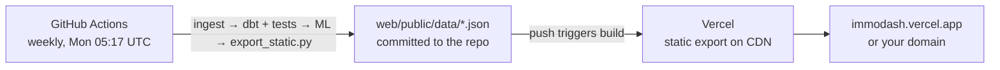

# Deploying ImmoDash (free, always on)

The public site is a **static site**: pre-built HTML pages plus a JSON snapshot of the API. It is served
from Vercel's CDN, so it never sleeps and loads instantly, unlike apps on Streamlit Cloud or Render's
free tier, which spin down when idle. A weekly GitHub Actions job keeps the data fresh. Both services are free.

| Piece | Where | Cost |
|---|---|---|
| Site (Next.js static export, 44 pages + 89 JSON files) | Vercel Hobby | free |
| Weekly data refresh | GitHub Actions (`.github/workflows/refresh-site.yml`) | free |
| CI on every push | GitHub Actions (`ci.yml`) | free |
| Custom domain (optional) | any registrar | about €10 a year |

The FastAPI service, Postgres and the Dash dashboard stay in the repo, tested in CI, and run
locally (`make demo` or `docker compose up`). The site uses the same API: `scripts/export_static.py`
calls every endpoint through the real FastAPI app and writes the responses as files.

---

## 1. Push the repo

From your terminal (see `docs/PUSH_TO_GITHUB.md`). The repo already contains a current snapshot in
`web/public/data/`, so the site can be built straight away.

## 2. Vercel

1. Sign in at [vercel.com](https://vercel.com) with GitHub. Choose the **Hobby** plan, which is free.
2. **Add New → Project → import `zoeb7184/immodash`.**
3. **Root Directory:** `web`. Framework: Next.js, detected automatically. Leave the build settings at their defaults.
4. No environment variables are needed. **Deploy.**
5. The site is live at `https://immodash.vercel.app`, or a similar name. You can rename it under
   Settings → Domains.

From now on, every push to `main` redeploys automatically, including the weekly data commits.

## 3. Weekly refresh

The workflow `.github/workflows/refresh-site.yml` is active as soon as the repo is on GitHub.

1. Run it once by hand: **Actions → refresh-site → Run workflow**. It takes about 3 minutes.
2. Optional: an LLM-written summary for each city. **Settings → Secrets and variables → Actions →
   New repository secret** `GROQ_API_KEY` (free key at console.groq.com). Without it, the summaries use the
   template. Any number in an LLM draft that cannot be found in the data causes the draft to be rejected.

How it behaves:

- If any step fails (a download, a dbt test, the model), nothing is committed and the live site keeps the
  last good snapshot. GitHub emails you about the failed run.
- Each run commits at least `meta.json` (with the run date). This keeps the repo active, because GitHub pauses
  scheduled workflows after 60 days without activity. If it ever is paused, the Actions tab shows
  an **Enable workflow** button.
- Sources update monthly (GREIX), quarterly or yearly, so a weekly run is enough.

## 4. Custom domain (optional)

1. Vercel → Project → **Settings → Domains → Add**, for example `immodash.yourname.de`.
2. At your registrar, create the record Vercel shows:
   - subdomain (`immodash.yourname.de`): `CNAME` → `cname.vercel-dns.com`
   - apex (`yourname.de`): `A` → `76.76.21.21`
3. HTTPS is issued automatically within minutes to a few hours.

## 5. Check it

- Open the site; the overview should show "data refreshed <date>".
- `https://<your-site>/data/meta.json` shows the snapshot date, the latest data month and the number of LLM summaries.
- Locally: `python scripts/verify.py` runs all checks, including the static build and serving every page.

---

## Optional: host the live API and analyst dashboard

Only needed if you want `/docs` (Swagger) or the Dash workbench online:

- **Render free tier:** free, but the service sleeps after about 15 minutes idle and the first request takes 30–60 s.
  Deploy the root `Dockerfile` as a web service with start command
  `uvicorn api.main:app --host 0.0.0.0 --port $PORT` and a free Postgres (expires after 30 days) or
  a free Neon database, set `DATABASE_URL`, and run `python flows/daily_refresh.py` once to load it.
- **Railway:** about $5 a month, no sleeping. Config-as-code files are in `deploy/railway/` (`api.toml`,
  `dashboard.toml`, `refresh.toml`). Set `DATABASE_URL=${{Postgres.DATABASE_URL}}` on each service.
